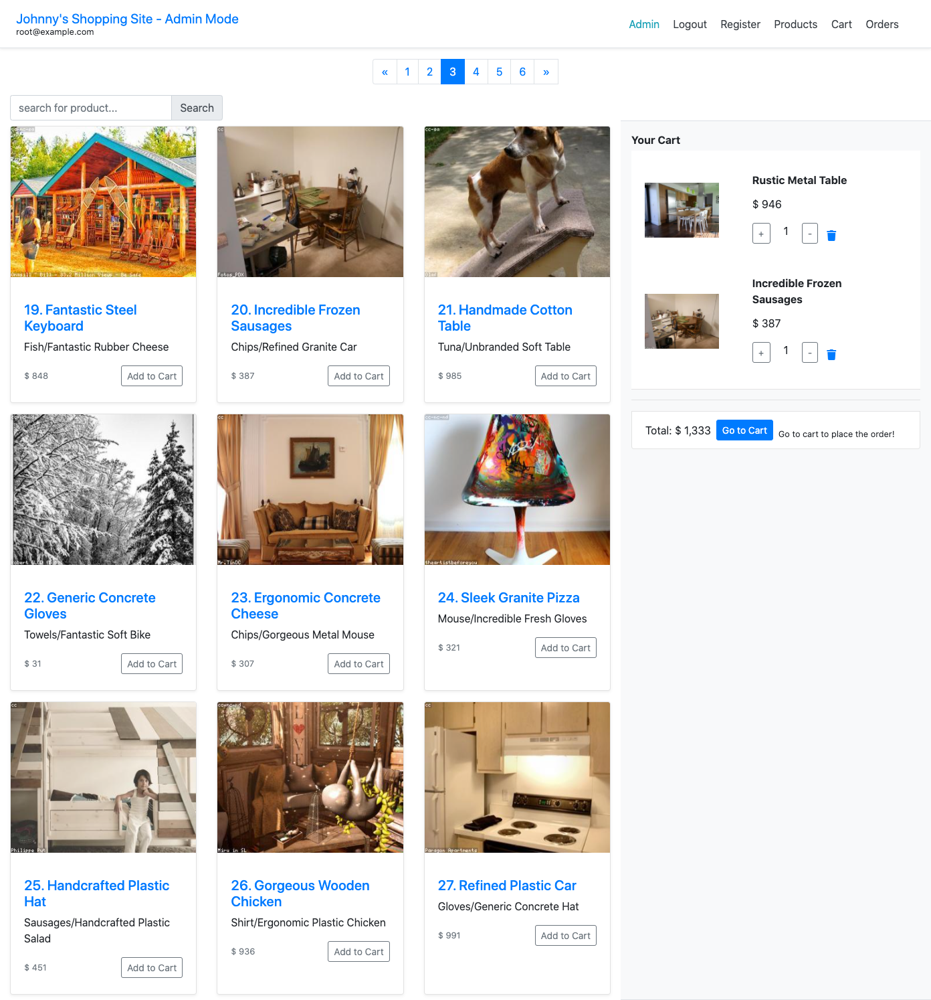

# Johnny's Shopping Site

A shopping site build with below tech stack:

- `Node.js`
- `Express` as web server
- `Handlebars` as view engine
- `MySQL` as database
- `Squelize` as ORM

- Third party API to handle transactions: [NewebPay](https://www.newebpay.com/)

## Features



<font size="4">The site has three different roles: **Visitor**, **User**, and **Admin** </font>

### Visitor

- Visitor is able to view the products
- Visitor is able to add products to shopping cart
- Visitor is able to view its shopping cart
- Visitor is able to remove products from shopping cart
- Visitor is able to register for an account and become **User**

### User

All features same as **Visitor**, plus

- User is able to login and logout
- User is able to make an order
- User is able to view all of its orders and orders' status
- User is able to cancel the orders
- User is able to make a payment with credit card

### Admin

**Admin** role is granted by developer, visitor/user cannot register for **Admin**.

- Admin is able to view, add, edit and remove products
- Admin is able to view all orders and their status
- Admin is able to cancel the orders
- Admin is **not able to** make an order nor a payment

## Quick Start

#### 1. Clone this repository

```
git clone git@github.com:johnnychang25678/shopping-site.git
```

#### 2. Install server dependencies

```
npm install
```

#### 3. Register for NewebPay testing account

- Link: https://cwww.newebpay.com/
- Register for enterprise account
- Download API doc: https://www.newebpay.com/website/Page/content/download_api

#### 4. Add a .env file to root folder, use .env.example as reference

```
MY_SESSION_SECRET=
MY_EMAIL=
EMAIL_TO=
GMAIL_PASSWORD=
URL=
MERCHANT_ID=
HASH_KEY=
HASH_IV=
IMGUR_CLIENT_ID=
```

#### 5. Install ngrok for testing NewebPay

- Download ngrok via offical site: https://ngrok.com/download
- Recommend to use homebrew for MacOS: https://gist.github.com/wosephjeber/aa174fb851dfe87e644e

#### 6. Set up MySQL database &

- Reference config/config.json to create a database locally
- migrate database with sequelize

```
npx sequelize db:migrate
```

- Add seed data to databse

```
npx sequelize db:seed:all
```

#### 7. Start the app

```
npm run start
or
npm run dev
```

#### 8. User ngrok to test out payment feature

- start ngrok

```
ngrok http 3000
```

- Change .env URL to ngrok https url

```
URL=https://yourNgrokUrl.ngrok.io
```

#### 9. Use below accounts to play around!

**Admin:**

email: root@example.com

password: 12345678

**User 1:**

email: user1@example.com

password: 12345678

**User 2:**

email: user1@example.com

password: 12345678
